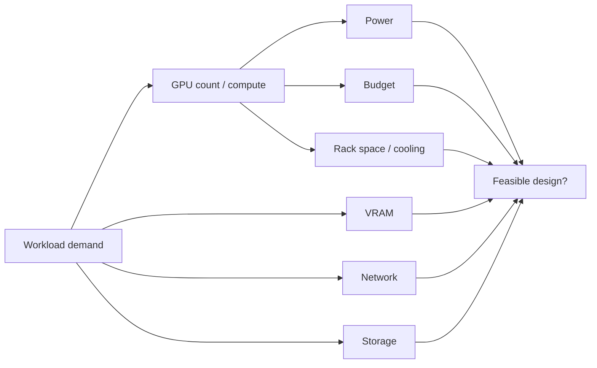

# Silicon-Tetris

> **The workloads keep coming, the rack has limits, and every “perfect” GPU plan breaks something else. Fit the compute puzzle before budget, power, memory, network, or storage runs out.**

## Project status

| Field | Current state |
|---|---|
| **Status** | **Planned — workload modeling begins early; final planner later in the roadmap** |
| **Current stage** | Campaign authored; no capacity recommendation, cost model, or sizing result is claimed complete |
| **Lab environment** | Laptop-based modeling with transparent workload assumptions and cited hardware specifications |
| **Evidence rule** | Separate measured values, vendor specifications, assumptions, estimates, and deliberately simplified models |
| **Last plan sync** | 2026-08-19 |
| **License** | No open-source license is granted unless an explicit license is added later |

## Skills you will build

- GPU capacity planning and workload sizing
- VRAM, compute, concurrency, and utilization reasoning
- Rack power and cooling constraints
- Network bandwidth and oversubscription concepts
- Storage throughput and checkpoint demand
- Cost modeling and budget tradeoffs
- Scenario analysis and sensitivity testing
- Python/YAML-based infrastructure modeling
- Constraint solving and capacity headroom
- Turning vague business demand into an engineering recommendation

## General idea

Silicon-Tetris is a **capacity-planning game disguised as an engineering project**.

A fictional AI company called **Mosaic Systems** is growing faster than its infrastructure. Product teams keep submitting new workloads—training jobs, fine-tuning, batch inference, and latency-sensitive inference—and every team insists its job is the highest priority.

You have finite:

- GPU memory,
- GPU count,
- rack space,
- power,
- cooling,
- network bandwidth,
- storage throughput,
- and money.

Your job is to build a small planning tool and use it to answer:

> **What should we buy, where should we place it, and which constraint becomes the bottleneck first?**

The project starts as manual reasoning and evolves into a Python-based planner that accepts workloads and constraints, evaluates candidate designs, and explains why a configuration fits—or fails.

---

# The game board

Mosaic begins with a request that sounds simple:

> “We need enough GPUs for next quarter.”

Then the real requirements arrive:

```text
Training team:       wants maximum throughput
Inference team:      wants low latency
Facilities:          caps rack power
Networking:          caps fabric bandwidth
Storage:             warns about checkpoint storms
Finance:             cuts the budget
Leadership:          wants 30% growth headroom
```

Every move solves one problem and creates another.

That is the game.

---

## Campaign levels

| Level | New pressure | Skill focus | Win condition |
|---|---|---|---|
| 00 | **Inventory the Pieces** | GPU/CPU/RAM/storage/network attributes | define the resource model |
| 01 | **Fit One Workload** | VRAM and compute needs | place a single job successfully |
| 02 | **The Queue Appears** | concurrency/capacity | place multiple workloads |
| 03 | **Power Ceiling** | watts/rack and headroom | redesign without exceeding facility limits |
| 04 | **The Network Tax** | east-west bandwidth | identify communication bottlenecks |
| 05 | **Checkpoint Avalanche** | storage throughput | account for I/O demand |
| 06 | **Budget Knife** | cost/performance | reduce spend while preserving requirements |
| 07 | **Inference Invades** | mixed workload types | balance latency and throughput needs |
| 08 | **Growth Quarter** | headroom and forecasting | survive a demand increase |
| 09 | **A GPU Is Unavailable** | resilience/capacity margin | maintain service with degraded resources |
| 10 | **Automate the Board** | Python/YAML modeling | generate repeatable capacity reports |
| FINAL | **Board Meeting From Hell** | full tradeoff defense | recommend an architecture under conflicting constraints |

---

## The resource puzzle



A design is not feasible because one number works. It is feasible only when **all important constraints are satisfied at the same time**.

---

## Build the planner gradually

### Stage 1 — Paper Tetris

Use a spreadsheet or Markdown table to reason manually about:

- workload GPU count
- VRAM requirement
- runtime/concurrency assumptions
- power
- network
- storage
- cost

This forces you to understand the model before automating it.

### Stage 2 — YAML Pieces

Represent workloads and hardware as data.

Example concept:

```yaml
workload:
  name: training-alpha
  type: training
  gpu_count: 4
  vram_per_gpu_gb: 24
  network_gbps: 80
  checkpoint_gb: 120

constraints:
  rack_power_kw: 40
  budget_usd: 500000
  growth_headroom_percent: 25
```

Values should come from clearly stated assumptions or cited specifications when you reach real hardware comparisons.

### Stage 3 — Python Board

Create code that can:

- load workload definitions,
- load candidate hardware,
- calculate resource demand,
- reject impossible placements,
- identify the limiting constraint,
- and summarize remaining headroom.

### Stage 4 — Scenario Engine

Change one assumption at a time:

```text
Demand +25%
Budget -15%
Rack power -5 kW
Checkpoint frequency doubles
One GPU node unavailable
Inference traffic triples
```

Then compare how the recommended design changes.

---

## Constraint cards

To keep the project playful, each new version can draw a constraint card.

### Card: The Model Got Bigger
VRAM requirement increases by 50%.

### Card: Facilities Says 30 kW
Your favorite design no longer fits the rack's power envelope.

### Card: Finance Found a Spreadsheet
Budget falls just after you finish the design.

### Card: Network Is the New GPU
Compute is available, but distributed jobs cannot feed data between nodes fast enough.

### Card: Nobody Predicted Inference
A new customer adds latency-sensitive demand to a cluster optimized for batch training.

### Card: Keep 20% in Reserve
Leadership wants growth capacity without an emergency hardware purchase.

The interesting artifact is how the architecture changes when the card is drawn.

---

## What not to do

Avoid fake precision.

A home lab cannot accurately predict production model throughput from a few guessed numbers. Label clearly:

- measured values,
- vendor specifications,
- assumptions,
- estimates,
- and intentionally simplified models.

The quality of the project comes from **transparent reasoning**, not pretending the planner knows more than it does.

---

## Evidence to keep

Useful outputs include:

- workload requirement files
- hardware profiles
- constraint definitions
- Python planner code
- unit tests for calculations
- scenario reports
- bottleneck explanations
- architecture comparisons
- cost/capacity graphs
- decision records
- rejected designs and why they failed

Keeping the rejected designs is important: they show that the model actually constrains decisions.

---

## Suggested repository structure

```text
Silicon-Tetris/
├── README.md
├── planner/
├── workloads/
├── hardware/
├── scenarios/
├── reports/
├── tests/
├── diagrams/
├── decisions/
└── evidence/
```

---

## Completion standard

Silicon-Tetris is complete when someone can hand you:

- a workload mix,
- a budget,
- a rack power limit,
- candidate GPUs,
- network/storage assumptions,
- and a growth target,

and you can produce a transparent recommendation that says:

> **what fits, what does not, what bottleneck appears first, and what tradeoff buys the most useful headroom.**

The final level is not finding a magical perfect configuration.

> **It is proving that you know which piece no longer fits—and why.**
